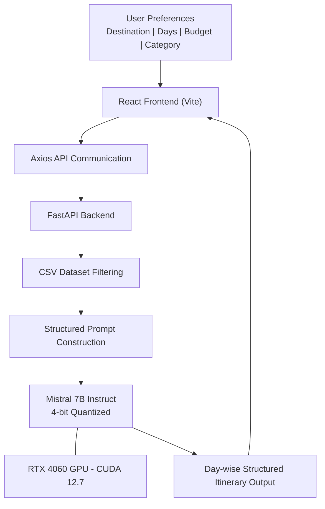

<h1 align="center">
  <a href="https://github.com/CommunityOfCoders/Inheritance2k25">
    CoC Inheritance 2025
  </a>
  <br>
  TravelGenie : AI-Powered Smart Travel Planning System
</h1>

<div align="center">
By Bitten By Python
</div>
<hr>

<details>
<summary>Table of Contents</summary>

- [Description](#description)
- [Links](#links)
- [Tech Stack](#tech-stack)
- [Progress](#progress)
- [Future Scope](#future-scope)
- [Applications](#applications)
- [Project Setup](#project-setup)
- [Team Members](#team-members)
- [Mentors](#mentors)

</details>

<a name="description"></a>

## 📝 Description

TravelGenie is an AI-powered smart travel planning system that generates personalized, structured, and optimized travel itineraries using a locally deployed Large Language Model.

It bridges the gap between generic travel suggestions and realistic, budget-aware planning by combining structured dataset filtering with contextual LLM generation. Built with React, FastAPI, and Mistral 7B Instruct running locally with GPU acceleration, TravelGenie delivers city-restricted and logically sequenced day-wise travel plans.

---

<a name="links"></a>

## 🔗 Links

- [GitHub Repository](https://github.com/Rehan1604/Travel_Genie-Inheritance-)
- [Demo Video](https://drive.google.com/file/d/17rnifMKwYDJi85VA_xYY3rXyMjG5T3Hy/view?usp=drive_link)
- [Project Screenshots/Drive](https://drive.google.com/drive/folders/1NHrsDFPxkjYD7yWH67OHcHFVX3k0ld5h?usp=drive_link)
- Hosted Website: Not Deployed Yet

---

<a name="tech-stack"></a>

## 🤖 Tech-Stack

### 🏗️ System Architecture



---

## Front-end

The user interface is built for clarity and interactivity, ensuring seamless itinerary generation.

**Framework:** React.js (Vite)  
**Communication:** Axios  
**Storage:** Browser localStorage  

### Key Features

- Dynamic chat-based input interface  
- Real-time itinerary rendering  
- Editable travel plans  
- Persistent storage of generated itineraries  

---

## Back-end

The backend handles dataset filtering, LLM orchestration, and structured output formatting.

**Framework:** FastAPI  
**Model Runtime:** HuggingFace Transformers + Accelerate  

### Core Components

- Dataset filtering engine (CSV-based)  
- Prompt construction logic  
- LLM inference pipeline  
- Structured response formatter  

---

## Database & Machine Learning

**Data Layer:** Structured CSV dataset (India, USA, Iran cities)  
**Includes:** Climate data, pricing ranges, category metadata  

### AI Infrastructure

- Mistral 7B Instruct  
- 4-bit quantization  
- NVIDIA RTX 4060 GPU  
- CUDA 12.7  

---

<a name="progress"></a>

## 📈 Progress

### Fully Implemented Features

* Personalized Day-wise Itinerary Generation  
* Budget-Aware Filtering  
* City-Restricted Recommendations  
* Climate Summary Integration  
* Local GPU Inference  

---

### Partially Implemented Features / Work in Progress

* Cloud Deployment  
* External API Integrations  
* Multi-city Route Optimization  

---

<a name="future-scope"></a>

## 🔮 Future Scope

- Real-time travel API integration  
- Multi-city itinerary optimization  
- User authentication and trip storage  
- Scalable LLM deployment  
- Advanced personalization mechanisms  

---

<a name="applications"></a>

## 💸 Applications

1. Personalized Travel Planning  
2. AI Travel Assistant Systems  
3. Academic AI Demonstration  

---

<a name="project-setup"></a>

## 🛠 Project Setup

### Clone Repository

```bash
git clone https://github.com/Rehan1604/Travel_Genie-Inheritance-.git
cd Travel_Genie-Inheritance-
```

### Backend Setup

```bash
cd backend
pip install -r requirements.txt
uvicorn main:app --reload
```

### Frontend Setup

```bash
cd frontend
npm install
npm run dev
```

Frontend runs via `npm run dev`.  
Backend runs via `uvicorn main:app --reload`.

---

<a name="team-members"></a>

## 👨‍💻 Team Members

* **Rehan Mehta** – https://github.com/Rehan1604  
* **Devansh Mehta** – https://github.com/Devansh270  
* **Bhavya Gothi** – https://github.com/Bhavya4523  
* **Jehan Bheda** – https://github.com/jehanbheda  

---

<a name="mentors"></a>

## 👨‍🏫 Mentors

* **Harsh Ogale** – https://github.com/harshogale04  
* **Piyush Patil** – https://github.com/MAVERICK-111
